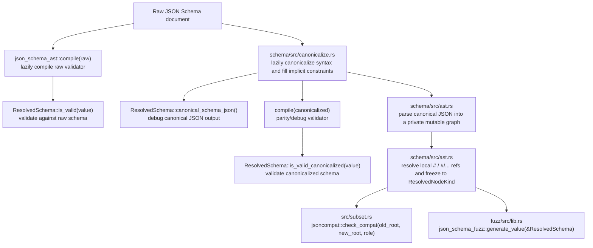

[](https://jsoncompat.com)

# jsoncompat

[](https://crates.io/crates/jsoncompat) [](https://docs.rs/jsoncompat) [](https://pypi.org/project/jsoncompat/) [](https://www.npmjs.com/package/jsoncompat) [](LICENSE)

Check compatibility of evolving JSON schemas.

> [!WARNING]
> Docs and examples at [jsoncompat.com](https://jsoncompat.com)
>
> This is alpha software. Not all incompatible changes are detected, and there may be false positives. Contributions are welcome!

Imagine you have an API that returns some JSON data, or JSON that you're storing in a database or file. You need to ensure that new code can read old data and that old code can read new data.

It's difficult to version JSON schemas in a traditional sense, because they can break in two directions:

1. If a schema is used by the party generating the data, or "serializer", then a change to the schema that can break clients using an older version of the schema should be considered "breaking." For example, removing a required property from a serializer schema should be considered a breaking change for a schema with the serializer role.

More formally, consider a serializer schema $S_A$ which is changed to $S_B$. This change should be considered breaking if there exists some JSON value that is valid against $S_B$ but invalid against $S_A$.

As a concrete example, if you're a webserver that returns JSON data with the following schema:

```json
{
  "type": "object",
  "properties": {
    "id": { "type": "integer" },
    "name": { "type": "string" }
  },
  "required": ["id", "name"]
}
```

and you make `name` optional:

```json
{
  "type": "object",
  "properties": {
    "id": { "type": "integer" },
    "name": { "type": "string" }
  },
  "required": ["id"]
}
```

then you've made a breaking change for any client that is using the old schema.

We assume that the serializer will not write additional properties that are not in the schema, even if additionalProperties is true. This allows us to consider a change to the schema that adds an optional property of some type not to be a breaking change.

1. If a schema is used by a party receiving the data, or "deserializer", then a change to the schema that might fail to deserialize existing data should be considered "breaking." For example, adding a required property to a deserializer should be considered a breaking change.

More formally, consider a deserializer schema $S_A$ which is changed to $S_B$. This change should be considered breaking if there exists some JSON value that is valid against $S_A$ but invalid against $S_B$.

As a concrete example, imagine that you've been writing code that saves JSON data to a database with the following schema:

```json
{
  "type": "object",
  "properties": {
    "id": { "type": "integer" },
    "name": { "type": "string" }
  },
  "required": ["id"]
}
```

and you make `name` required, attempting to load that data into memory by deserializing it with the following schema:

```json
{
  "type": "object",
  "properties": {
    "id": { "type": "integer" },
    "name": { "type": "string" }
  },
  "required": ["id", "name"]
}
```

you'll be unable to deserialize any data that doesn't have a `name` property, which is a breaking change for the `deserializer` role.

If a schema is used by both a serializer and a deserializer, then a change to the schema that can break either should be considered "breaking."

## Supported features

Most JSON Schema Draft 2020-12 keywords are supported. Notable partial support:

- **`format`**: Support for `date`, `date-time`, `time`, `email`, `idn-email`, `uri`, `iri`, `uri-reference`, `iri-reference`, `uuid`, `ipv4`, `ipv6`,
  `hostname`, `idn-hostname`.
- **`pattern`** (regex): Best-effort string generation from regex patterns. Complex patterns (e.g. backreferences) may not produce matching strings.
- **Array constraints**: `prefixItems`, `contains`, `minContains`, `maxContains`, and `uniqueItems` are represented in the AST used for compatibility checks and example generation.
- When `format` or `pattern` is used, `minLength`/`maxLength` constraints are ignored during example generation.

## Rust workspace architecture

The Rust code is split into five crates and one CLI binary. The website under `web/` is a separate frontend and is not part of the compatibility engine.

| Path | Package | Responsibility |
| --- | --- | --- |
| `schema/` | `json_schema_ast` | Draft 2020-12 dialect checks, schema canonicalization, AST construction, local `$ref` resolution, and direct validator compilation via `jsonschema` |
| `src/` | `jsoncompat` | Backward-compatibility checking over resolved ASTs, plus the `jsoncompat` CLI in `src/bin/jsoncompat.rs` |
| `fuzz/` | `json_schema_fuzz` | Schema-guided JSON instance generation and random schema generation for fuzz tests |
| `python/` | `jsoncompat_py` | PyO3 bindings that expose `check_compat` and `generate_value` |
| `wasm/` | `jsoncompat_wasm` | `wasm-bindgen` bindings that expose `check_compat` and `generate_value` to JavaScript |

The two core schema APIs are:

- `json_schema_ast::compile(&raw_schema)`, which compiles the original schema document directly with the `jsonschema` validator backend. Before compilation, this crate rejects any `$schema` declaration other than Draft 2020-12 (`https://json-schema.org/draft/2020-12/schema`, with an optional trailing `#`).
- `json_schema_ast::ResolvedSchema::from_json(&raw_schema)`, which eagerly stores the original raw schema JSON and lazily materializes derived views on first use:
  - `ResolvedSchema::is_valid(&value) -> Result<bool, SchemaBuildError>` lazily compiles a validator from the original raw schema document.
  - `ResolvedSchema::is_valid_canonicalized(&value) -> Result<bool, SchemaBuildError>` lazily canonicalizes the schema, compiles a validator from the canonicalized JSON, and exists to test/debug whether canonicalization preserved semantics.
  - `ResolvedSchema::root() -> Result<&ResolvedNode, SchemaBuildError>` lazily canonicalizes the schema, resolves local refs, and exposes the immutable canonicalized graph used by compatibility analysis and fuzzing/codegen.
  - `ResolvedSchema::raw_schema_json()` returns the original raw schema document.
  - `ResolvedSchema::canonical_schema_json() -> Result<&Value, SchemaBuildError>` lazily returns the canonicalized schema document as JSON so humans can inspect the rewrite directly.
    `ResolvedNodeKind` only contains post-resolution semantic variants; parser-only `$ref` and declaration metadata variants are private implementation details.

At a high level, the runtime flow is:



### What each crate owns

- `json_schema_ast` is the schema frontend and resolved IR crate. `schema/src/ast.rs` stores the raw input schema immediately, and lazily asks `schema/src/canonicalize.rs` for a deterministic canonical form only when a caller requests `root()`, `canonical_schema_json()`, or `is_valid_canonicalized()`. The resolved graph is then built by parsing that canonical JSON into a private mutable parse graph, resolving local recursive references, and freezing it into `ResolvedNodeKind`. `ResolvedSchema::is_valid()` is intentionally backed by the validator compiled from the original raw schema. `ResolvedSchema::raw_schema_json()` preserves the original input schema for debugging and comparisons. `ResolvedNode::accepts_value()` is the internal evaluator for canonicalized AST subgraphs used by compatibility/fuzzing heuristics. `ResolvedNode::to_json()` remains a debug/test helper and should not be used as a production semantic bridge.
- `jsoncompat` is the static compatibility checker. `src/lib.rs` defines `Role` and `check_compat`, and `src/subset.rs` implements the actual inclusion relation (`sub ⊆ sup`) over `ResolvedNode`. The checker now uses `ResolvedNode::accepts_value()` for finite-value membership checks and keeps a cycle guard for recursive subset proofs.
- `json_schema_fuzz` is the value-generation engine. Its public APIs take `ResolvedSchema` and only return values accepted by `ResolvedSchema::is_valid()`; if the internal candidate generator cannot find such a value within its retry budget, generation returns a typed `GenerateError::ExhaustedAttempts`. Internally it walks the canonicalized `ResolvedNode` graph and uses `ResolvedNode::accepts_value()` only as a pruning heuristic for recursive subgraphs.
- `jsoncompat_py` and `jsoncompat_wasm` are thin adapters. They parse JSON strings, call the Rust core crates, and map Rust errors/results into Python or JavaScript types.

### Test strategy

- `tests/backcompat.rs` checks expected serializer/deserializer compatibility outcomes for hand-authored old/new schema pairs, then fuzzes each direction to look for concrete counterexamples.
- `tests/fuzz.rs` runs the JSON-Schema-Test-Suite fixture corpus through `ResolvedSchema::from_json`, asks `json_schema_fuzz::ValueGenerator` for raw-valid examples, and asserts that `ResolvedSchema::is_valid_canonicalized()` returns the same answer on those instances. Fixtures that rely on unsupported reference-resource features are skipped when schema build returns a typed resolver error, and known generation gaps are tracked by explicit `GenerateError::ExhaustedAttempts` whitelist entries.
- `schema/src/canonicalize/integration_tests.rs` and `schema/src/roundtrip_tests.rs` test canonicalization and AST round-tripping directly.

## What is still missing for “complete” Draft 2020-12 support?

This crate should not be described as a complete JSON Schema implementation yet. The current architecture is useful, but there are still explicit semantic gaps in the resolver, AST, generator, and subset checker.

### 1. Full schema resource and reference resolution

Current behavior:

- Local JSON Pointer references of the form `"#"` and `"#/..."` are resolved.
- Recursive local `$ref` graphs are supported by representing schemas as shared `Rc` nodes.
- Non-local `$ref`s, `$id`, `$anchor`, `$dynamicRef`, and `$dynamicAnchor` are rejected with typed `UnsupportedReference` errors. Missing local pointers return `UnresolvedReference`.

Missing for completeness:

- `$id`-scoped base URI handling across nested schema resources.
- `$anchor` resolution for plain fragment references such as `"#foo"`.
- `$dynamicRef` / `$dynamicAnchor` dynamic-scope resolution.
- Remote reference loading and a resource-store abstraction for multi-document schemas.
- Cross-draft reference handling. Today, only Draft 2020-12 is accepted.

### 2. Annotation-aware keywords and evaluation bookkeeping

Current AST support includes `properties`, `patternProperties`, `required`, `additionalProperties`, `propertyNames`, `dependentRequired`, `prefixItems`, `items`, `contains`, `minContains`, `maxContains`, and `uniqueItems`.

Missing or only partially represented:

- `dependentSchemas` is canonicalized but not represented in `ResolvedNodeKind::Object`, so the checker and generator do not enforce it.
- `unevaluatedProperties` and `unevaluatedItems` are canonicalized but not represented with the evaluated-location bookkeeping required by the spec.
- Keywords whose behavior depends on annotation collection through applicators (`$ref`, `allOf`, `anyOf`, `oneOf`, `if`/`then`/`else`, `not`) are not modeled with an explicit annotation/evaluation layer.
- Content keywords and most annotation keywords are intentionally stripped during canonicalization, so they are not preserved as part of the semantic IR.

### 3. Complete set-inclusion reasoning over the AST

`check_compat` is implemented as a structural subset check over `ResolvedNodeKind`, with evaluator-backed membership checks for finite examples and a recursive pair guard for cyclic proofs. That is practical, but not a complete decision procedure for all represented schemas.

Known incompleteness:

- Arbitrary `not` reasoning is shallow. The checker only handles a few boolean/`Any` cases and otherwise returns `false` rather than proving inclusion through complement logic.
- Union/intersection reasoning is branch-local and conservative. For example, `sub ⊆ (anyOf [...])` currently requires finding one branch that contains all of `sub`, which can miss valid proofs that require splitting `sub` across multiple branches.
- String-language inclusion is incomplete. `pattern` and `format` are represented on string nodes, but the subset checker does not currently prove regex-language or format-language containment.
- `patternProperties` containment is conservative and mostly syntactic: matching exact regex keys is handled, but there is no general regex-language inclusion engine.

### 4. A single executable schema semantics layer

There are now three semantics paths:

- `jsonschema` validators compiled from raw JSON, exposed through `json_schema_ast::compile` and `ResolvedSchema::is_valid()`, as the external oracle/backend for actual validation.
- `jsonschema` validators compiled from canonicalized JSON, exposed through `ResolvedSchema::is_valid_canonicalized()`, as a parity/debug path for canonicalization.
- `ResolvedNode::accepts_value()` over the frozen canonicalized graph, used by compatibility and generation heuristics.

`src/subset.rs` and the private candidate generator in `fuzz/src/lib.rs` use the resolved-graph evaluator for finite-value checks over the canonicalized IR, while public generation/validation APIs use `ResolvedSchema::is_valid()` as the raw-schema oracle for user-visible results. `ResolvedNode::to_json()` is documented as lossy and serializes a tree-shaped view, not graph backedges, so it is kept for debug/test round-tripping only. The remaining architecture gap is that `schema/src/canonicalize.rs` still performs some semantic simplification (`allOf` / `anyOf` / `oneOf` / `not` folding) that is also implemented on the resolved graph; consolidating those rewrites into one layer is still a worthwhile follow-up.

## Debugging canonicalization

To inspect the canonicalized schema document that backs compatibility checks and generation:

```bash
jsoncompat canonicalize schema.json --pretty
```

For programmatic checks, compare `ResolvedSchema::raw_schema_json()` with `ResolvedSchema::canonical_schema_json()`, and compare `ResolvedSchema::is_valid(value)` with `ResolvedSchema::is_valid_canonicalized(value)` on representative instances.

### 5. Generator completeness

The fuzzer is designed to generate values that usually satisfy a schema, not to enumerate all satisfying values or guarantee uniform coverage.

Current gaps:

- Regex generation is best-effort; complex patterns may not produce matching strings.
- `format` generation only covers a finite list of common formats.
- `not`, `oneOf`, and overlapping applicator schemas are handled heuristically.
- Recursive generation is depth-limited and biased toward simple values.


## Development

Requirements:

Run [bootstrap.sh](bootstrap.sh) to install the necessary dependencies.

Run tests:

```bash
just check
```

Run the performance benchmark harnesses:

```bash
just bench
```

The schema operation benchmarks use a fixed handpicked corpus under
[benches/fixtures](benches/fixtures) so broad fuzz fixture changes do not move
the benchmark baseline.

For a fast smoke check of the benchmark binary:

```bash
just bench-check
```

See the [Justfile](Justfile) for more commands

## Releasing

`just release` will dry-run the release process for a patch release.

Right now, releases to PyPI and npm are done in CI via manual dispatch of the `CI` workflow
on a tag. Releases to cargo are done manually for now.

Merging to main will trigger a release of the website.
