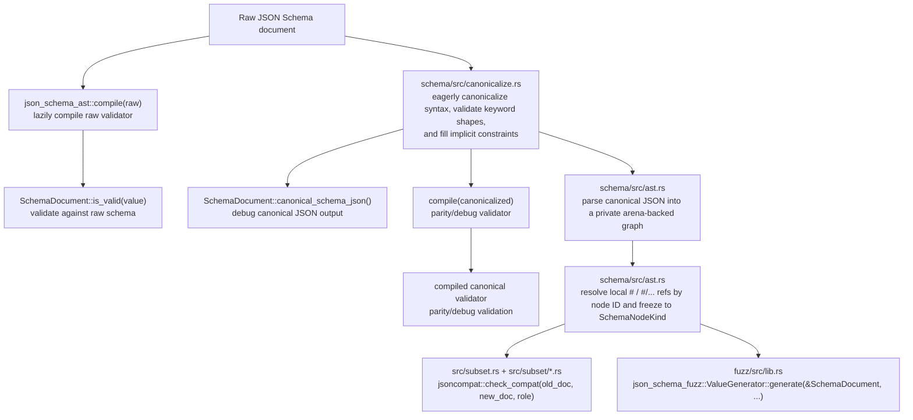

[](https://jsoncompat.com)

# jsoncompat

[](https://crates.io/crates/jsoncompat) [](https://docs.rs/jsoncompat) [](https://pypi.org/project/jsoncompat/) [](https://www.npmjs.com/package/jsoncompat) [](LICENSE)

Check compatibility of evolving JSON schemas and OpenAPI contracts.

jsoncompat supports raw JSON Schema Draft 2020-12 documents, standalone OpenAPI 3.1
Schema Objects, and path-operation OpenAPI 3.1 JSON documents passed to `jsoncompat compat`.
If a schema declares `$schema`, it must be either
`https://json-schema.org/draft/2020-12/schema` with an optional trailing `#`, or
`https://spec.openapis.org/oas/3.1/dialect/base`. OpenAPI 3.0-only schema semantics such
as `nullable` are not interpreted; use the OpenAPI 3.1 / JSON Schema form instead.

> [!WARNING]
> Docs and examples at [jsoncompat.com](https://jsoncompat.com)
>
> This is alpha software. Not all incompatible changes are detected, and there may be false positives. Contributions are welcome!

## Installation and basic usage

Install the CLI with Cargo:

```bash
cargo install jsoncompat
```

Check whether a schema change is compatible for a serializer:

```bash
jsoncompat compat old-schema.json new-schema.json --role serializer
```

Check whether a schema change is compatible in both serializer and deserializer directions, with fuzzing enabled to look for a concrete counterexample:

```bash
jsoncompat compat old-schema.json new-schema.json --role both --fuzz 1000 --depth 8
```

Check whether an OpenAPI 3.1 contract change is backward-compatible:

```bash
jsoncompat compat old-openapi.json new-openapi.json
```

Generate example JSON values accepted by a schema:

```bash
jsoncompat generate schema.json --count 5 --pretty
```

Compare two golden schema files in CI:

```bash
jsoncompat ci old-golden.json new-golden.json --display table
```

Run the guided CLI smoke test:

```bash
jsoncompat demo --noninteractive
```

## Motivation

Imagine you have an API that returns some JSON data, or JSON that you're storing in a database or file. You need to ensure that new code can read old data and that old code can read new data.

It's difficult to version JSON schemas in a traditional sense, because they can break in two directions:

1. If a schema is used by the party generating the data, or "serializer", then a change to the schema that can break clients using an older version of the schema should be considered "breaking." For example, removing a required property from a serializer schema should be considered a breaking change for a schema with the serializer role.

   More formally, consider a serializer schema $S_A$ which is changed to $S_B$. This change should be considered breaking if there exists some JSON value that is valid against $S_B$ but invalid against $S_A$.

   As a concrete example, if you're a webserver that returns JSON data with the following schema:

   ```json
   {
     "type": "object",
     "properties": {
       "id": { "type": "integer" },
       "name": { "type": "string" }
     },
     "required": ["id", "name"]
   }
   ```

   and you make `name` optional:

   ```json
   {
     "type": "object",
     "properties": {
       "id": { "type": "integer" },
       "name": { "type": "string" }
     },
     "required": ["id"]
   }
   ```

   then you've made a breaking change for any client that is using the old schema.

   We assume that the serializer will not write additional properties that are not in the schema, even if additionalProperties is true. This allows us to consider a change to the schema that adds an optional property of some type not to be a breaking change.

1. If a schema is used by a party receiving the data, or "deserializer", then a change to the schema that might fail to deserialize existing data should be considered "breaking." For example, adding a required property to a deserializer should be considered a breaking change.

   More formally, consider a deserializer schema $S_A$ which is changed to $S_B$. This change should be considered breaking if there exists some JSON value that is valid against $S_A$ but invalid against $S_B$.

   As a concrete example, imagine that you've been writing code that saves JSON data to a database with the following schema:

   ```json
   {
     "type": "object",
     "properties": {
       "id": { "type": "integer" },
       "name": { "type": "string" }
     },
     "required": ["id"]
   }
   ```

   and you make `name` required, attempting to load that data into memory by deserializing it with the following schema:

   ```json
   {
     "type": "object",
     "properties": {
       "id": { "type": "integer" },
       "name": { "type": "string" }
     },
     "required": ["id", "name"]
   }
   ```

   you'll be unable to deserialize any data that doesn't have a `name` property, which is a breaking change for the `deserializer` role.

   If a schema is used by both a serializer and a deserializer, then a change to the schema that can break either should be considered "breaking."

## Rust API

The `jsoncompat` crate has a small document-level API:

```rust
use jsoncompat::{Role, SchemaDocument, check_compat};
use serde_json::json;

let old = SchemaDocument::from_json(&json!({ "type": "string" })).unwrap();
let new = SchemaDocument::from_json(&json!({ "type": ["string", "null"] })).unwrap();

let compatible = check_compat(&old, &new, Role::Deserializer).unwrap();
```

- `SchemaDocument::from_json(&Value)` builds and canonicalizes a Draft 2020-12 schema document or OpenAPI 3.1 Schema Object.
- `check_compat(&old, &new, Role::Serializer | Role::Deserializer | Role::Both)` returns whether the schema change is compatible for that role.
- `CompatibilityError` reports schema construction failures and compatibility features that are intentionally rejected instead of approximated.
- `json_schema_fuzz::ValueGenerator::generate(&schema, GenerationConfig::new(depth), rng)` is the separate Rust value-generation API.

OpenAPI contract compatibility uses a parallel typed entrypoint:

```rust
use jsoncompat::{OpenApiDocument, check_openapi_compat};
use serde_json::json;

let old = OpenApiDocument::from_json(&json!({
    "openapi": "3.1.0",
    "info": { "title": "Pets", "version": "1.0.0" },
    "paths": {}
})).unwrap();
let new = old.clone();

let report = check_openapi_compat(&old, &new).unwrap();
assert!(report.is_compatible());
```

- `OpenApiDocument::from_json(&Value)` builds an OpenAPI 3.1 JSON contract document.
- `check_openapi_compat(&old, &new)` lowers each shared operation into synthetic request and response schemas, then reuses the normal compatibility checker underneath.
- `OpenApiCompatibilityReport::issues()` lists operation removals plus request- and response-surface incompatibilities.
- `explain_compat_failure(&old, &new, role)` returns a best-effort structural explanation for schema incompatibilities; `jsoncompat compat` includes the same style of explanation in CLI output for both raw JSON Schema and OpenAPI inputs when it can. Explanations start with a role-aware schema JSON Pointer such as `new schema #/properties/status`; OpenAPI comparisons use the lowered per-operation request or response schema that the compatibility engine checks.

## Support checklist

Legend:

- ✅: the backcompat checker has an explicit subset rule, or the fuzzer has direct
  schema-guided candidate construction for that keyword.
- 🟡: the feature is parsed/evaluated, but the checker is conservative or the fuzzer is
  heuristic/retry-based for that keyword.
- ⚪: the keyword is accepted or stripped, but it is not represented in the resolved IR and does
  not contribute checker/fuzzer semantics.
- ⛔: schema construction fails with a typed error before the checker/fuzzer runs.

Important global caveats:

- `jsoncompat::check_compat` is a document-level structural subset checker over the resolved AST. It can return
  false negatives for conservative subset proofs, including string-language cases where a required
  `pattern` or `format` changes rather than staying exactly the same.
- Compatibility checks reject non-integral `number.multipleOf` constraints with a typed
  `CompatibilityError` instead of approximating fractional divisor inclusion with `f64`.
- Runtime validation (`SchemaDocument::is_valid`) always delegates to the `jsonschema`
  backend compiled from the raw schema document, so non-`f64` numeric schemas/values follow
  the backend's support limits rather than the compatibility checker's exact numeric model.
- For serializer compatibility, the checker assumes serializers do not emit undeclared extra
  properties, even when `additionalProperties: true`.
- `json_schema_fuzz::ValueGenerator::generate` walks the resolved AST heuristically, then validates every
  candidate with the raw `jsonschema` backend. If the resolved schema is known to have no valid
  instances, it returns `GenerateError::Unsatisfiable` deterministically; otherwise, if no valid
  candidate is found within the retry budget, it returns `GenerateError::ExhaustedAttempts`.
- Boolean schema documents `true` and `false` are supported directly. `false` has no valid
  instances, so generation returns `Unsatisfiable`.
- Unknown extension keywords are preserved only when needed to keep local ref targets addressable;
  otherwise they are ignored by both the checker and the fuzzer.

### Scalar schemas

| Keyword | Compat | Fuzz | Notes |
| --- | :-: | :-: | --- |
| `type` | ✅ | ✅ | Supports `null`, `boolean`, `object`, `array`, `string`, `number`, `integer`, and unions of those primitive types. |
| `enum` | ✅ | ✅ | Numeric equality follows JSON Schema semantics, so `1` and `1.0` are treated as equal. |
| `const` | ✅ | ✅ | Same semantic numeric equality as `enum`. |
| `minimum` | ✅ | ✅ | Integer bounds are normalized exactly where possible; number bounds use `f64`. |
| `maximum` | ✅ | ✅ | Integer bounds are normalized exactly where possible; number bounds use `f64`. |
| `exclusiveMinimum` | ✅ | 🟡 | Integer exclusives are canonicalized into inclusive integer bounds; number generation may rely on validator retries around open lower bounds. |
| `exclusiveMaximum` | ✅ | 🟡 | Integer exclusives are canonicalized into inclusive integer bounds; number generation may rely on validator retries around open upper bounds. |
| `multipleOf` | 🟡 | ✅ | Exact integer divisibility is supported for `integer` schemas and integer-valued `number.multipleOf`. Compatibility checks reject non-integral `number.multipleOf` constraints instead of approximating fractional divisor inclusion; runtime validation and generation still accept those schemas. |
| `minLength` | ✅ | 🟡 | The generic string generator respects this bound, but the `format` and `pattern` paths may ignore it and rely on validator retries. |
| `maxLength` | ✅ | 🟡 | The generic string generator respects this bound, but the `format` and `pattern` paths may ignore it and rely on validator retries. |
| `pattern` | 🟡 | 🟡 | `SchemaNode::accepts_value()` enforces regexes for finite-value checks using a cached matcher per pattern. For open string subset proofs, `check_compat` only treats a required comparison-target pattern as preserved when the subset keeps that exact same pattern; different required patterns fail conservatively instead of being approximated. Unsupported ECMAScript regex constructs are preserved as source text but treated as non-matching by the internal evaluator. Regex generation is best-effort and does not guarantee coverage for complex constructs. |
| `format` | 🟡 | 🟡 | For open string subset proofs, `check_compat` only treats a required comparison-target format as preserved when the subset keeps that exact same format; different required formats fail conservatively instead of being approximated. The fuzzer only synthesizes `date`, `date-time`, `time`, `email`, `idn-email`, `uri`, `iri`, `uri-reference`, `iri-reference`, `uuid`, `ipv4`, `ipv6`, `hostname`, and `idn-hostname`; unknown formats fall back to generic strings. |
| `contentEncoding` | ⚪ | ⚪ | Canonicalized for syntax, then stripped from the semantic IR. |
| `contentMediaType` | ⚪ | ⚪ | Canonicalized for syntax, then stripped from the semantic IR. |
| `contentSchema` | ⚪ | ⚪ | Nested schemas are canonicalized and ref-checked, but content decoding/validation is not modeled in the semantic IR. |

### Object schemas

| Keyword | Compat | Fuzz | Notes |
| --- | :-: | :-: | --- |
| `properties` | ✅ | ✅ | Property schemas are compared recursively and generated directly. |
| `required` | ✅ | ✅ | Missing required properties are synthesized before generation returns a candidate. |
| `additionalProperties` | ✅ | ✅ | Checker support is subject to the serializer assumption above; the fuzzer generates additional keys only when this schema is not `false`. |
| `patternProperties` | 🟡 | 🟡 | Exact same regex keys are compared structurally, and property values are checked against every matching pattern schema. If the superset has no `patternProperties`, subset patterns fall back to `additionalProperties`; otherwise the checker does not prove regex-language inclusion between different patterns. The fuzzer does not synthesize property names from regexes. |
| `propertyNames` | 🟡 | 🟡 | Checker support depends on subset reasoning for the property-name schema itself, so regex/format caveats still apply. The fuzzer can generate keys from string/enum schemas and otherwise falls back to random names plus acceptance checks. |
| `minProperties` | ✅ | ✅ | Canonicalization raises `minProperties` to at least the number of required keys. |
| `maxProperties` | ✅ | ✅ | Checked structurally and used as a hard upper bound during generation. |
| `dependentRequired` | ✅ | 🟡 | The checker accounts for trigger keys admitted by `properties`, `patternProperties`, or `additionalProperties`. The fuzzer does not proactively synthesize dependencies, but invalid candidates are rejected by the final validator pass. |
| `dependentSchemas` | ⚪ | ⚪ | Nested schemas are canonicalized for dialect/ref validation, but `SchemaNodeKind::Object` does not store `dependentSchemas`, so checker/fuzzer semantics are absent. |
| `unevaluatedProperties` | ⚪ | ⚪ | Canonicalized recursively but not represented with evaluated-location bookkeeping in the resolved IR. |
| `dependencies` | ⚪ | ⚪ | Legacy keyword accepted by the parser but not represented in the resolved IR; use `dependentRequired` / `dependentSchemas` for Draft 2020-12 semantics. |

### Array schemas

| Keyword | Compat | Fuzz | Notes |
| --- | :-: | :-: | --- |
| `items` | ✅ | ✅ | Schema-form `items` is compared recursively and used for tail-item generation. Tuple arrays must use Draft 2020-12 `prefixItems`; legacy tuple-form `items: [...]` is rejected. |
| `prefixItems` | ✅ | ✅ | Compared positionally and generated positionally. |
| `additionalItems` | ⚪ | ⚪ | Legacy keyword not represented in the resolved array node, so it does not affect compatibility or generation. |
| `minItems` | ✅ | ✅ | Defaults to `minContains` (or `1`) when `contains` is present, otherwise `0`. |
| `maxItems` | ✅ | ✅ | Checked structurally and used as a hard upper bound during generation. |
| `contains` | ✅ | 🟡 | Checker reasoning handles item-match count constraints structurally. The fuzzer tries to force or avoid matching items, but this is heuristic and may rely on retries. |
| `minContains` | ✅ | 🟡 | Participates in structural count reasoning for `contains`; the fuzzer uses best-effort witness construction plus validator retries. |
| `maxContains` | ✅ | 🟡 | Participates in structural count reasoning for `contains`; the fuzzer uses best-effort witness avoidance plus validator retries. |
| `uniqueItems` | ✅ | 🟡 | The checker handles the common sound cases; the fuzzer retries and then uses a synthetic fallback object for unconstrained item schemas if duplicates persist. |
| `unevaluatedItems` | ⚪ | ⚪ | Canonicalized recursively but not represented with evaluated-location bookkeeping in the resolved IR. |

### Applicators and conditionals

| Keyword | Compat | Fuzz | Notes |
| --- | :-: | :-: | --- |
| `allOf` | 🟡 | 🟡 | Canonicalization simplifies trivial boolean branches. The checker is branch-local and can miss proofs such as `allOf[A, B] <= A` when only one branch is inspected. The fuzzer merges object branches heuristically and otherwise picks one non-trivial branch. |
| `anyOf` | 🟡 | 🟡 | The checker requires every `sub` branch to fit `sup`, and for `sup anyOf` it looks for one branch containing all of `sub`; that is conservative and can miss valid disjunctive proofs. The fuzzer samples one branch and retries. |
| `oneOf` | 🟡 | 🟡 | Canonicalization rewrites provably disjoint `oneOf` branches to `anyOf`. Outside that case, checker reasoning is conservative and does not symbolically prove exact-one exclusivity, and the fuzzer uses retry-based witness counting. |
| `not` | 🟡 | 🟡 | The checker only handles shallow boolean/`Any` cases symbolically; other `not` proofs fall back to conservative `false`. The fuzzer generates type-mismatch and fixed candidate witnesses, then retries against the full schema. |
| `if` | 🟡 | 🟡 | `SchemaNode::accepts_value()` evaluates the condition and the fuzzer samples branches, but the subset checker has no dedicated symbolic rule for conditional implication beyond exact-node equality and finite `const`/`enum` probes. |
| `then` | 🟡 | 🟡 | Stored and evaluated only as part of `if` / `then` / `else`; checker reasoning inherits the same conditional caveat as `if`. |
| `else` | 🟡 | 🟡 | Stored and evaluated only as part of `if` / `then` / `else`; checker reasoning inherits the same conditional caveat as `if`. |

### Document shape, references, and metadata

| Keyword | Compat | Fuzz | Notes |
| --- | :-: | :-: | --- |
| `$ref` | ✅ | 🟡 | Same-document refs to `"#"` and `"#/..."` are supported, including recursive graphs. Pure alias cycles and non-local refs are rejected with typed resolver errors. Generation is depth-limited. |
| `$anchor` | ⛔ | ⛔ | Plain-name fragment anchors are rejected; only JSON Pointer refs are supported today. |
| `$dynamicRef` | ⛔ | ⛔ | Dynamic refs are rejected during schema resolution. |
| `$dynamicAnchor` | ⛔ | ⛔ | Dynamic anchors are rejected during schema resolution. |
| `$id` | ⛔ | ⛔ | Resource-scope identifiers are rejected because reference resolution is currently same-document only. |
| `$defs` | ✅ | 🟡 | Acts as a local ref target container; nested schemas are canonicalized and resolved, but `$defs` is not a semantic node by itself. |
| `definitions` | ✅ | 🟡 | Legacy ref target container with the same caveat as `$defs`. |
| `title` | ⚪ | ⚪ | Preserved as metadata in canonical JSON, but not used by checker/fuzzer semantics. |
| `$comment` | ⚪ | ⚪ | Stripped or preserved only as metadata; no compatibility or generation semantics. |
| `description` | ⚪ | ⚪ | Stripped or preserved only as metadata; no compatibility or generation semantics. |
| `default` | ⚪ | ⚪ | Stripped or preserved only as metadata; default values are not synthesized or used for compatibility. |
| `examples` | ⚪ | ⚪ | Stripped or preserved only as metadata; examples do not guide fuzzing. |
| `deprecated` | ⚪ | ⚪ | Annotation only; ignored by checker and fuzzer semantics. |
| `readOnly` | ⚪ | ⚪ | Annotation only; ignored by checker and fuzzer semantics. |
| `writeOnly` | ⚪ | ⚪ | Annotation only; ignored by checker and fuzzer semantics. |
| `$vocabulary` | ⚪ | ⚪ | Annotation only; no dialect negotiation semantics are modeled. |

## Rust workspace architecture

The Rust code is split into five crates and one CLI binary. The website under `web/` is a separate frontend and is not part of the compatibility engine.

| Path | Package | Responsibility |
| --- | --- | --- |
| `schema/` | `json_schema_ast` | Draft 2020-12 dialect checks, schema canonicalization, AST construction, local `$ref` resolution, and direct validator compilation via `jsonschema` |
| `src/` | `jsoncompat` | Backward-compatibility checking over resolved ASTs, plus the `jsoncompat` CLI in `src/bin/jsoncompat.rs` |
| `fuzz/` | `json_schema_fuzz` | Schema-guided JSON instance generation for fuzz tests and example values |
| `python/` | `jsoncompat_py` | PyO3 bindings that expose `check_compat`, `generate_value`, and role constants |
| `wasm/` | `jsoncompat_wasm` | `wasm-bindgen` bindings that expose `check_compat` and `generate_value` to JavaScript |

The primary schema APIs are:

- `json_schema_ast::compile(&raw_schema)`, which compiles the original schema document directly with the `jsonschema` validator backend. Before compilation, this crate rejects any `$schema` declaration other than Draft 2020-12 (`https://json-schema.org/draft/2020-12/schema`, with an optional trailing `#`) or the OpenAPI 3.1 Schema Object dialect (`https://spec.openapis.org/oas/3.1/dialect/base`).
- `json_schema_ast::SchemaDocument::from_json(&raw_schema)` (alias: `SchemaDocument::from_json`), which eagerly stores the original raw schema JSON, eagerly canonicalizes and validates the schema document once, and then lazily materializes compiled validators on first use:
  - `SchemaDocument::is_valid(&value) -> Result<bool, SchemaBuildError>` lazily compiles a validator from the original raw schema document.
  - `SchemaDocument::canonical_schema_json() -> Result<&Value, SchemaBuildError>` returns the cached canonicalized schema document as JSON so humans can inspect the rewrite directly.
- `json_schema_fuzz::ValueGenerator::generate(&SchemaDocument, GenerationConfig, rng) -> Result<Value, GenerateError>`, which is the Rust generation API.
- `jsoncompat::OpenApiDocument::from_json(&raw_openapi)` plus `jsoncompat::check_openapi_compat(&old, &new)`, which compare OpenAPI 3.1 JSON documents by lowering operations into request and response envelope schemas before invoking the same subset checker.

The resolved IR extension API is public because `jsoncompat` and
`json_schema_fuzz` are separate crates. `SchemaDocument::root()` lazily resolves
local refs from the canonicalized JSON and exposes the immutable graph used by
compatibility analysis and generation. Each `SchemaNode` has an opaque `NodeId`
for cycle-safe identity. `SchemaNodeKind` only contains post-resolution semantic
variants; parser-only `$ref` and declaration metadata variants are private
implementation details. Scalar/object/array constraints are represented with
normalized typed domains (`IntegerBounds`, `NumberBounds`, `CountRange`,
`ContainsConstraint`, `PatternConstraint`) instead of loose keyword pairs, and
regex support is explicit via `PatternSupport`.

At a high level, the runtime flow is:



### What each crate owns

- `json_schema_ast` is the schema frontend and resolved IR crate. `schema/src/ast.rs` stores the raw input schema immediately and canonicalizes it once inside `SchemaDocument::from_json()` so keyword-shape validation happens at schema construction without maintaining a second validator path. The resolved graph is still built lazily by parsing that cached canonical JSON into a private arena-backed graph, resolving local recursive references, normalizing applicators, and freezing it into `SchemaNodeKind`. Unsupported or non-productive refs fail with typed resolver errors. `SchemaDocument::is_valid()` is intentionally backed by the validator compiled from the original raw schema. `SchemaNode::accepts_value()` is the low-level evaluator for canonicalized AST subgraphs used by compatibility/fuzzing heuristics.
- `jsoncompat` is the static compatibility checker. `src/lib.rs` defines `Role`, document-level `check_compat`, and the OpenAPI compatibility surface. `src/openapi.rs` lowers OpenAPI 3.1 operations into synthetic request/response schemas that model parameters, request bodies, status/media variants, response headers, local component refs, and operation removal. `src/subset.rs` plus `src/subset/{scalar,object,array}.rs` implement the actual inclusion relation (`sub ⊆ sup`) over `SchemaNode`. The checker uses `SchemaNode::accepts_value()` for finite-value membership checks and keeps a cycle guard for recursive subset proofs.
- `json_schema_fuzz` is the value-generation engine. Its public value-generation API is `ValueGenerator::generate(&SchemaDocument, GenerationConfig, rng)` and it only returns values accepted by `SchemaDocument::is_valid()`; if the resolved schema is known to be empty, generation returns a typed `GenerateError::Unsatisfiable`, and if the internal candidate generator cannot find a value within its retry budget, generation returns a typed `GenerateError::ExhaustedAttempts`. Internally it walks the canonicalized `SchemaNode` graph and uses `SchemaNode::accepts_value()` only as a pruning heuristic for recursive subgraphs.
- `jsoncompat_py` and `jsoncompat_wasm` are thin adapters. They parse JSON strings, call the Rust core crates, and map Rust errors/results into Python or JavaScript types.

### Test strategy

- `tests/backcompat.rs` checks expected serializer/deserializer compatibility outcomes for hand-authored old/new schema pairs, then fuzzes each direction to look for concrete counterexamples.
- `tests/fuzz.rs` runs the JSON-Schema-Test-Suite fixture corpus through `SchemaDocument::from_json`, asks `json_schema_fuzz::ValueGenerator` for raw-valid examples, compiles `SchemaDocument::canonical_schema_json()` to assert canonicalization parity, and additionally checks `SchemaNode::accepts_value()` against the canonicalized validator on schemas that stay within the internal evaluator's supported subset. Fixtures that rely on unsupported reference-resource features are skipped when schema build returns a typed resolver error, and known generation gaps are tracked by explicit `GenerateError::ExhaustedAttempts` whitelist entries.
- `tests/openapi_fixtures.rs` runs the OpenAPI contract regression corpus under `tests/fixtures/openapi_compat`, including focused `anyOf` request/response evolution cases where shallow diffing can miss serializer- or deserializer-side incompatibilities.
- `schema/src/canonicalize/integration_tests.rs` and `schema/src/roundtrip_tests.rs` test canonicalization and AST round-tripping directly.

## Debugging canonicalization

To inspect the canonicalized schema document that backs compatibility checks and generation, compare the raw schema you passed to `SchemaDocument::from_json()` with `SchemaDocument::canonical_schema_json()`, and compile the canonical JSON with `json_schema_ast::compile()` if you need validator-level parity checks on representative instances. Canonicalization is an internal library facility, not a `jsoncompat` CLI subcommand.

### OpenAPI compatibility

`jsoncompat compat old-openapi.json new-openapi.json` auto-detects OpenAPI 3.1
JSON documents and compares:

- path, query, header, and cookie parameters, including requiredness, schema/content shape, and serialization controls (`style`, `explode`, `allowReserved`, and `allowEmptyValue`);
- request bodies, their requiredness, media types, and schemas;
- response status/media/body variants and response headers, including header requiredness;
- removed operations;
- local `#/components/...` references for parameters, request bodies, responses, headers, and schema refs under `#/components/schemas/...`.

The OpenAPI constructor intentionally accepts a narrow document root: `openapi`, `info`,
`jsonSchemaDialect`, `paths`, `components`, and top-level `x-*` extensions. It rejects other
document-level OpenAPI fields before lowering, including `servers`, `webhooks`, `security`, `tags`,
and `externalDocs`, rather than silently accepting metadata or compatibility-bearing surfaces that
jsoncompat does not model yet. The lowerer likewise rejects remote refs, unsupported OpenAPI versions,
unsupported document-level `jsonSchemaDialect` values, unsupported path-item or operation fields
outside the accepted lowering surface, operation-level `security` requirements, operation `callbacks`,
and media-type `encoding` surfaces instead of approximating them. Supported document-level dialects
are applied to lowered request and response contract schemas.
It currently accepts JSON OpenAPI documents, matching the rest of the CLI's JSON-first input model.
`--role` and `--fuzz` remain raw-JSON-Schema-only flags; OpenAPI comparisons always check request compatibility in the deserializer direction and response compatibility in the serializer direction together.
CLI flows fail invalid JSON Schema or OpenAPI inputs before attempting generation, grading, or compatibility reporting.
Response media-type additions are treated as backward-risky because they expand the serializer-side
response contract; `oasdiff` currently reports that case as non-breaking, so the two tools intentionally
differ there.

## Development

Requirements:

Run [bootstrap.sh](bootstrap.sh) to install the necessary dependencies.

Run tests:

```bash
just check
```

Run the end-to-end CLI demo/smoke test:

```bash
cargo run --bin jsoncompat -- demo
```

By default the demo pauses before each step. For CI/non-interactive runs, pass:

```bash
cargo run --bin jsoncompat -- demo --noninteractive
```

Run the performance benchmark harnesses:

```bash
just bench
```

The schema operation benchmarks use a fixed handpicked corpus under
[benches/fixtures](benches/fixtures) so broad fuzz fixture changes do not move
the benchmark baseline.

For a fast smoke check of the benchmark binary:

```bash
just bench-check
```

See the [Justfile](Justfile) for more commands

## Releasing

`just release` will dry-run the release process for a patch release.

Right now, releases to PyPI and npm are done in CI via manual dispatch of the `CI` workflow
on a tag. Releases to cargo are done manually for now.

Merging to main will trigger a release of the website.
